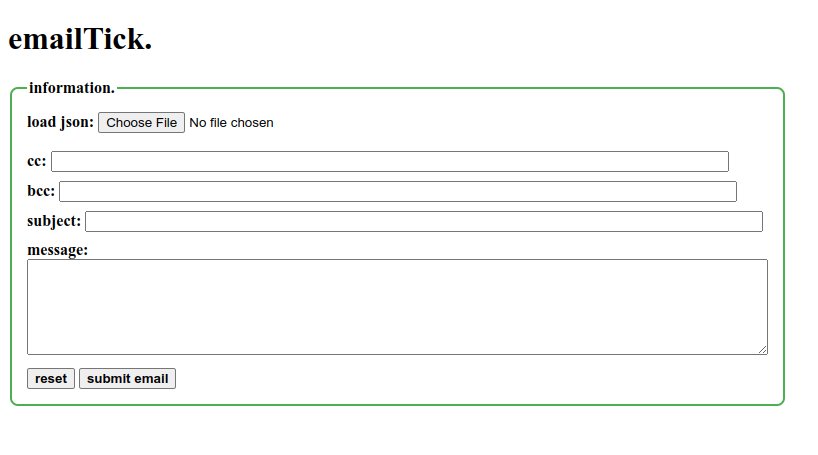
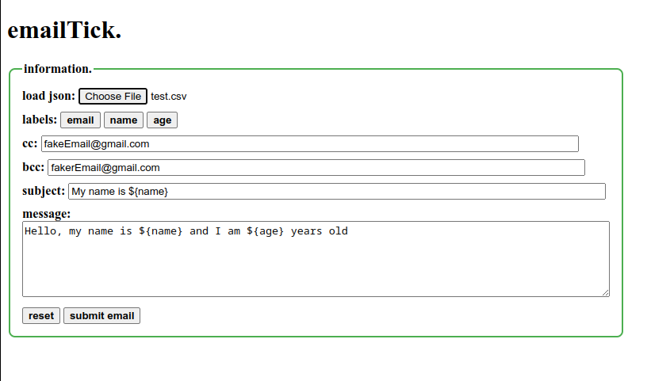

# emailTick

## overview

this project allows you to send a templated email to email list based off of information given in a csv.

<hr>

## installation

```bash
git clone https://github.com/tkofb/emailTick.git

cd emailTick/

npm install
```

### step 1: create a new google cloud project

- Go to the [Google Cloud Console](https://console.cloud.google.com/).
- Sign in with your Google account.
- Click on the **Select a project** dropdown at the top.
- Click **New Project**.
- Enter a **Project Name** and select a **Billing Account** (if required).
- Click **Create** and wait for the project to be set up.
### step 2: enable gmail api

- In the **Google Cloud Console**, navigate to **APIs & Services > Library**.
- Search for **Gmail API**.
- Click on **Gmail API** and then click **Enable**.
### step 3: create oauth 2.0 credentials

- Navigate to **APIs & Services > Credentials**.
- Click **Create Credentials** and select **OAuth client ID**.
- If prompted, configure the **OAuth Consent Screen**:
    - Select **External** (unless you're using an internal organization account).
    - Enter **App Name**, **User Support Email**, and **Developer Contact Email**.
    - Click **Save and Continue**.
- Select **Application Type** as **Desktop App** (or Web App if applicable).
- Enter a name for the credentials (e.g., "Gmail API Credentials").
- Click **Create**.
- Click **Download JSON** to obtain the `credentials.json` file.
### step 4: ensure required scopes

When using the API, ensure your application requests the following scopes:

``` javascript
const SCOPES = [
  "https://www.googleapis.com/auth/gmail.readonly",
  "https://www.googleapis.com/auth/gmail.modify",
  "https://www.googleapis.com/auth/gmail.compose",
  "https://www.googleapis.com/auth/gmail.send",
  "https://www.googleapis.com/auth/userinfo.profile",
];
```
### step 5: store `credentials.json`

- Move the downloaded `credentials.json` file to your home project directory.
- Ensure your application loads it properly when initializing OAuth authentication.

### step 6: move your csv into the datasets folder

- After you create your csv with your information make sure to move it to the datasets folder
	- Take note that each row corresponds to an email query
- **Required!!! : make sure there is an email column for each row** 
- There will be a test dataset given to you to as an example

<hr>

## usage

```bash
node src/
```

<hr>

## example view

#### without template guidelines



#### with template guidelines



<hr>

## dependencies

- [@google-cloud/local-auth](https://www.npmjs.com/package/@google-cloud/local-auth)
- [body-parser](https://www.npmjs.com/package/body-parser)
- [convert-csv-to-json](https://www.npmjs.com/package/convert-csv-to-json)
- [d3](https://www.npmjs.com/package/d3)
- [dotenv](https://www.npmjs.com/package/dotenv)
- [ejs](https://www.npmjs.com/package/ejs)
- [express](https://www.npmjs.com/package/express)
- [fs](https://www.npmjs.com/package/fs)
- [googleapis](https://www.npmjs.com/package/googleapis)
- [papaparse](https://www.npmjs.com/package/papaparse)
- [path](https://www.npmjs.com/package/path)

<hr>

## contributing

pull requests are welcome. for major changes, please open an issue first  
to discuss what you would like to change.  

please make sure to update tests as appropriate.  

<hr>

## license

[MIT](https://choosealicense.com/licenses/mit/)
